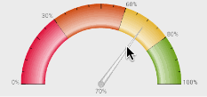

# 仪表盘 InstrumentPanel

项目设计稿有个高光效果的仪表盘控件，网上也没有找到有高光效果的控件，于是只能自己做一个

###### 还有一个简单的交互效果



```
<com.fjwangjia.android.instrumentpanel.InstrumentPanelView
        android:id="@+id/info"
        android:layout_width="match_parent"
        android:layout_height="200dp"
        android:background="#ececec"
        app:textColor="#555"
        app:textSize="12dp"/>

／／第一个参数设置颜色 第二个参数介于 0-1 之间的浮点数 
        instrumentPanelView.addBlock(new Block(0xFFDC143C,0.3f));
        instrumentPanelView.addBlock(new Block(0xFFCD4B1C, 0.6f));
        instrumentPanelView.addBlock(new Block(0xFFE3B33F, 0.8f));
        instrumentPanelView.addBlock(new Block(0xFF6B9E22, 1f));
   

／／或者

        List<Block> blocks = new ArrayList<>();
        blocks.add(new Block(0xFFDC143C,0.3f));
        instrumentPanelView.setBlockList(blocks);

／／设置指针指向的位置 0-1 之间 
／／在postDelayed中调用 可以看到有一个阻尼振荡的动画效果
        instrumentPanelView.postDelayed(new Runnable() {
                @Override
                public void run() {
                    instrumentPanelView.pointerTo(0.6f);
                }
            }, 1000);

```

### dependencies

```
compile 'com.fjwangjia.android:instrumentpanel:1.0.2'
```